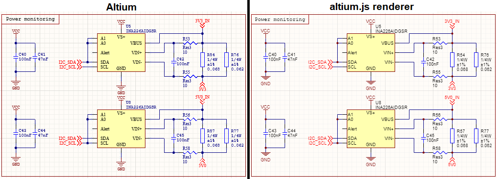

# altium.js

altium.js is a JavaScript library for parsing and rendering Altium schematic (SchDoc) files in the browser. It currently handles most features of schematic documents as of Altium Designer version 22.5.



## Quick Start

To take altium.js for a test drive, open `altium_sch.html` in a browser. A demo document will be opened and displayed. Click the "Choose File" button at the top to load a SchDoc file. It will be rendered below. If you scroll past the preview, you'll also find a CSV-compatible bill of materials (BoM).

Altium SchDoc files are OLE Compound Documents. The main stream within the document is a sequence of records, each of which comprises an ASCII/UTF8 encoded set of properties. You can read more about the internal format and record types [in the python-altium documentation](https://github.com/vadmium/python-altium/blob/master/format.md).

## Console Queries

The `altium_sch.html` page creates a global variable called `altiumDocument`, which is an `AltiumDocument` object. It has the following properties:

- `objects` - an array of objects in the document, each typed to a specific class (e.g. `AltiumComponent`, `AltiumWire`, `AltiumParameter`, etc.), with each class being a subclass of `AltiumObject`. this is the main output of the parser, and is most likely where you want to start querying for things.
- `sheet` - provides convenient access to the sheet object for the document.
- `records` - an array of record entries extracted from the underlying file format. each record entry is processed into an object by the parser. records refer to each other by their indices (starting at 0, which is usually a sheet record).
- `record_object_lookup` - a mapping object from record indices to their resultant objects. you can use this to take a record index and find the object that was created from it. each `AltiumObject` has a `record_index` property that acts as the inverse mapping, and you can also access the record directly (without needing to do a secondary lookup) using the object's  `source_record` property.
- `stream` - a stream object that represents the underlying bytes of the schematic data. the schematic data stream is extracted from the SchDoc file, which is an OLE compound document.

Each `AltiumObject` has a `parent_object` field and a `child_objects` field to help traverse the document hierarchy.

### Query Examples

You can run these queries in your browser console. This section should also be useful reference if you want to roll your own tooling using this library.

#### Finding components by part name:

The following query finds all components with a design item ID of "AO3401A":

```javascript
altiumDocument.objects.filter(
    o => o instanceof AltiumComponent && 
    o.design_item_id == "AO3401A")
```

You can also search by description, for example if you wanted to find all MOSFETs:

```javascript
altiumDocument.objects.filter(
    o => o instanceof AltiumComponent && 
    o.description.includes("MOSFET"))
```

#### Finding components by designator:

Designators and components are separate objects, and there is some complexity to how they work.

You can search for a designator by its text as follows:

```javascript
altiumDocument.objects.filter(
    o => o instanceof AltiumDesignator && #
    o.text == "U4")
```

However, if U4 is a multi-part component (e.g. an LM324 with four separate opamp parts) this query will return separate designator objects for each part, _all_ with the text "U4". This is because the suffix letters (U4A, U4B, etc.) are added by Altium at runtime based on the associated component's current part ID. A helper property, `full_designator`, is included to get around this inconvenience:

```javascript
altiumDocument.objects.filter(
    o => o instanceof AltiumDesignator && 
    o.full_designator == "U4A")
```

The parent object of the designator is _usually_ an `AltiumComponent`, so you can use the `parent_object` property to find parts with the exact specified designator:

```javascript
altiumDocument.objects.filter(
    o => o instanceof AltiumDesignator &&
    o.full_designator == "U4A"
).map(d => d.parent_object)
```

However, due to implementation complexities and variances across Altium versions, there may be additional mapping objects sat between the current object and the parent object you want to find. In such a case, the direct parent object of the `AltiumDesignator` might not be an `AltiumComponent`, but something else. To make things more reliable, you can use the `find_parent()` helper function on any `AltiumObject` in order to find a parent of a specific type:

```javascript
altiumDocument.objects.filter(
    o => o instanceof AltiumDesignator && 
    o.full_designator == "R3"
).map(d => d.find_parent(AltiumComponent))
```

#### Finding components by footprint:

Footprints, simulation models, and signal integrity models are all represented internally by "implementations". All implementations are saved in the file _regardless_ of whether they are the currently active ones, so if you've got a generic resistor part with footprints for 0603, 0805, etc. then there will be separate `AltiumImplementation` objects for each of those. You can tell whether an implementation is actively selected by checking its `is_current` property.

Each `AltiumImplementation` is typically a child of an `AltiumImplementationList` object, which itself is typically a child of an `AltiumComponent`. The `find_parent()` helper is useful for traversing the hierarchy here.

For example, this query finds all components that have a SOT23 footprint currently selected:

```javascript
altiumDocument.objects.filter(
    o => o instanceof AltiumImplementation && 
    o.is_footprint && o.is_current && 
    o.model_name.includes("SOT23")
).map(f => f.find_parent(AltiumComponent))
```

#### Finding power ports:

You can search for power ports by name as follows:

```javascript
altiumDocument.objects.filter(
	o => o instanceof AltiumPowerPort && 
	o.text == "VCC")
```

You can also search by the _type_ of power port:

```javascript
altiumDocument.objects.filter(
	o => o instanceof AltiumPowerPort && 
	o.style_name == "POWER_GND")
```

The defined power port names are ARROW, BAR, WAVE, POWER_GND, SIGNAL_GND, EARTH, GOST_ARROW, GOST_POWER_GND, GOST_EARTH, and GOST_BAR. A value of DEFAULT is used to represent two possible port types: when `is_off_sheet_connector` is false it represents a circle port, and when it is true it represents an off-sheet connector.

#### Accessing underlying properties:

The parser handles a lot of the translation from underlying attributes into a clean format, but, for the most part, only the properties that were necessary to implement the renderer are actually parsed out to a high-level value. You can still access all of the underlying attributes, though, through the `attributes` and `raw_attributes` fields on every `AltiumObject`. If you can't find the value you're looking for directly in an object, check the attributes field.

The `attributes` field is an object built from all of the underlying attributes, with special characters in the name replaced with underscores. You can also access the raw attributes as an array of objects with `name` and `value` fields. All values are strings.

For example, if I wanted to know whether the sheet border is enabled, I could check the following value:

```javascript
altiumDocument.sheet.attributes.borderon
```

This will either be "T" for true, or "F" for false. It could also be missing, since many fields are not added to documents if the field value is the default.

## Rolling your own

The `altium_sch_document.js` script contains the parser, which you invoke using the `AltiumDocument` class constructor. It needs access to the data from inside the "FileHeader" stream of the OLE Compound Document file. A rudimentary OLE parser is included in `ole.js`, and several helper scripts are also required (`base64_binary.js`, `helper_extensions.js`, and `u8stream.js`).

Given a SchDoc file as an `ArrayBuffer` object, you can invoke the parser as follows:

```javascript
// parse the ArrayBuffer as an OLE Compound Document
let ole = new OLE(data);
// find the FileHeader stream
let fileHeader = ole.directory_entries.find(de => de.name == "FileHeader");
// read the result as a U8Stream (a wrapper around Uint8Array)
let fileHeaderData = fileHeader.read_all();
// parse it as an Altium document
let altiumDocument = new AltiumDocument(fileHeaderData);
```

The `altium_sch_renderer.js` script takes a document and renders it to a canvas object:

```javascript
let renderer = new AltiumSchematicRenderer(canvas, altiumDocument);
renderer.render();
```

You can take a look at `altium_sch.html` for further reference.

## Known issues

There are some known issues.

**Parser:**

- The OLE parser is very rudimentary and only supports reading data from a single contiguous stream. My understanding of OLE Compound Document formats is limited, but it is possible that very large SchDoc files (55MB+) will not load properly due to exceeding 110 sectors in size.

**Renderer:**

- Buses and bus entries aren't drawn.
- Ports (regular ones, not power ports) aren't drawn.
- "No ERC" blocks and markers aren't drawn.
- Sheet symbols and sheet entries aren't drawn.
- Sheet information blocks aren't drawn.
- Vertical alignment of text in text frames does not account for extra lines caused by word wrap.
- Alignment of rotated text is sometimes a bit off, and vertical text may be horizontally flipped in some cases compared to Altium.
- Only power bars, power ground, and earth symbols are supported for power ports. All others are just drawn as a box.
- Power port symbols are always drawn in their "natural" orientation, i.e. ground facing down and power bars facing up.

If you want to open a PR to fix any of these, that'd be appreciated.

## License

altium.js and its components are released under [MIT License](LICENSE.txt).

The `base64_binary.js` file was developed by Daniel Guerrero. See the file contents for software licensing information.

Special thanks to Martin Panter, who authored the [python-altium library](https://github.com/vadmium/python-altium) and saved me a lot of reverse engineering work.
